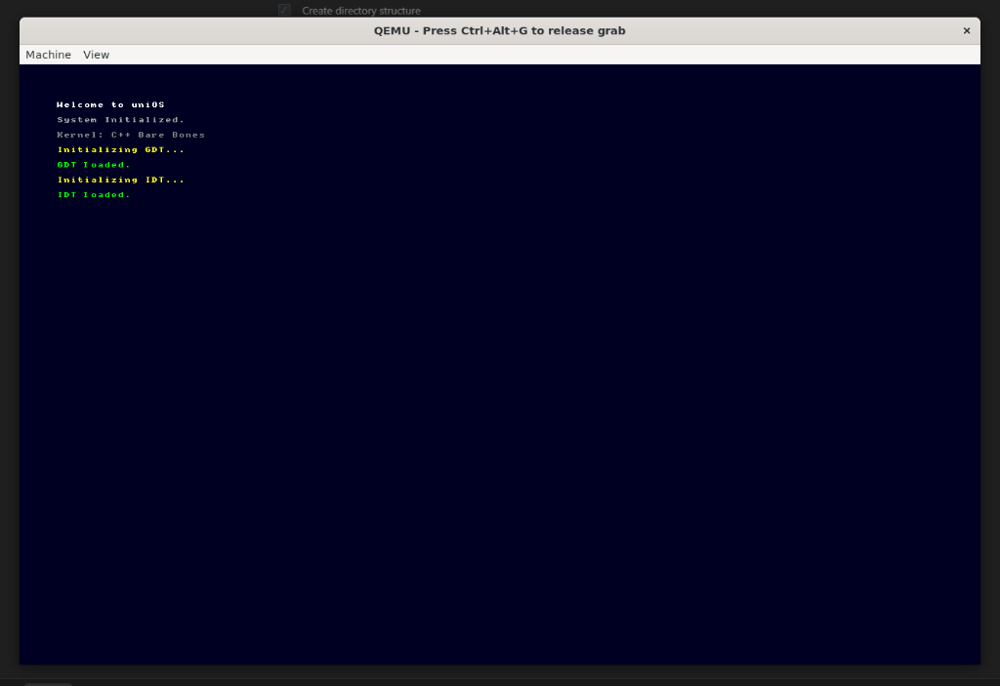

# uniOS

A visionary x86-64 operating system engineered from scratch to redefine the standards of desktop computing.



## Features

- **Lightning-fast responsiveness** - Streamlined architecture optimized for maximum speed and minimal resource usage
- **Modern UI/UX** - Beautiful, modern interface crafted for both functionality and style
- **Clean codebase** - Maintainable and modular code developed entirely in-house
- **x86-64 architecture** - Built for modern 64-bit processors

## Current Status

### Implemented
- [x] Limine bootloader integration
- [x] Framebuffer graphics output
- [x] Bitmap font rendering
- [x] Global Descriptor Table (GDT) with TSS
- [x] Interrupt Descriptor Table (IDT)

### Roadmap
- [ ] PS/2 Keyboard driver
- [ ] Memory management (Physical & Virtual)
- [ ] Process scheduling
- [ ] Filesystem support
- [ ] User-space applications

## Building

### Prerequisites
- GCC (x86_64-elf cross-compiler recommended)
- NASM
- xorriso
- QEMU (for testing)

### Build Instructions

```bash
# Clone the repository
git clone https://github.com/YOUR_USERNAME/uniOS.git
cd uniOS

# Clone Limine bootloader
git clone https://github.com/limine-bootloader/limine.git --branch=v8.x-binary --depth=1
make -C limine

# Build the OS
make

# Run in QEMU
make run
```

## Project Structure

```
uniOS/
├── kernel/
│   ├── kernel.cpp      # Main kernel entry point
│   ├── gdt.cpp/h       # Global Descriptor Table
│   ├── idt.cpp/h       # Interrupt Descriptor Table
│   ├── font.h          # Bitmap font for text rendering
│   ├── linker.ld       # Linker script
│   ├── gdt_asm.asm     # GDT assembly helpers
│   └── interrupts.asm  # Interrupt stubs
├── limine.conf         # Bootloader configuration
├── Makefile            # Build system
└── README.md
```

## License

This project is open source. See LICENSE file for details.

## Contributing

Contributions are welcome! Please feel free to submit a Pull Request.
